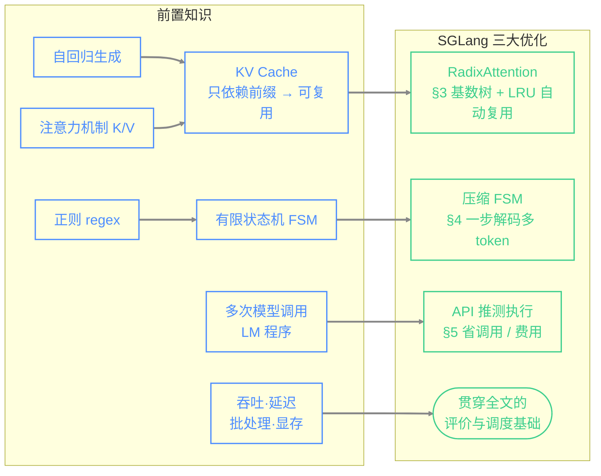
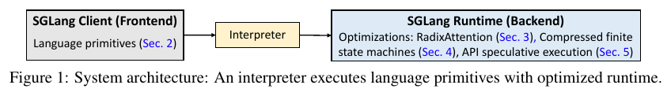
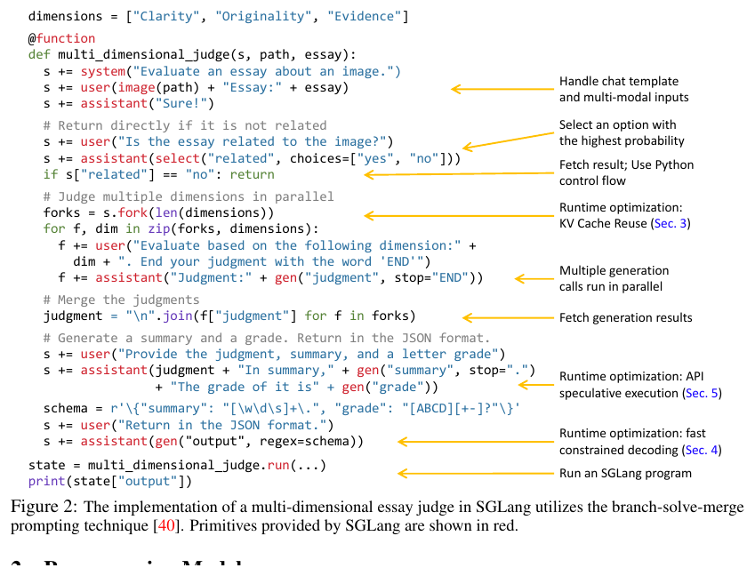
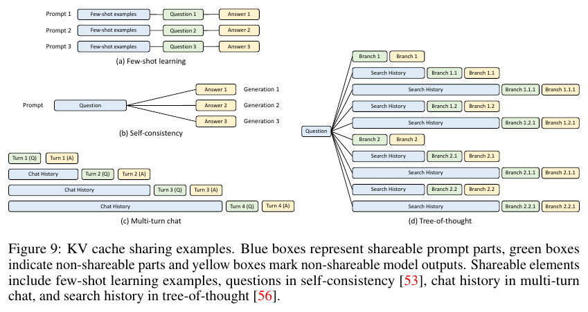
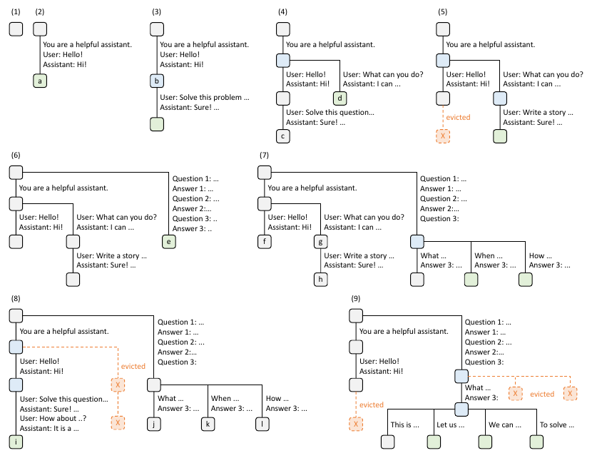
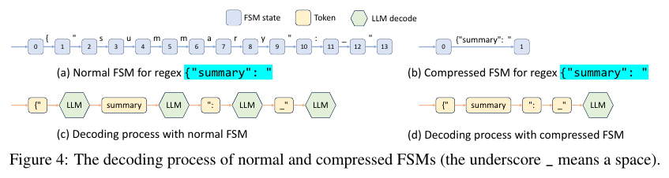
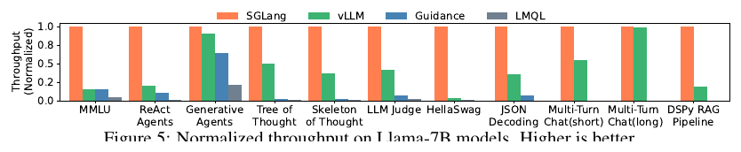

# SGLang 学习笔记

> 论文：*SGLang: Efficient Execution of Structured Language Model Programs*
> 作者：Lianmin Zheng, Liangsheng Yin, Zhiqiang Xie, Ying Sheng 等（Stanford / UC Berkeley / SJTU / Texas A&M）
> arXiv：2312.07104v2（2024-06-06）｜ 代码：https://github.com/sgl-project/sglang
>
> 本笔记面向"入门层次"读者（会用 LLM，但不熟 Transformer / 注意力内部机制）。
> 阅读路线：先看 **第 0 部分（前置知识地图）** 建立地基 → 再按 **第 1–5 部分** 逐块理解论文 → 用 **第 6 部分（速记卡）与第 7 部分（自测题）** 巩固。

---

## 0. 前置知识地图（读这篇论文之前你需要知道的）

这篇论文属于 **"LLM 推理系统（inference systems）"** 方向。它不是讲怎么训练模型、也不是讲新模型结构，而是讲**怎么把已有的大模型跑得更快、更省**。要读懂，你需要下面这几块地基。按"必须懂 / 最好懂 / 了解即可"分三档。

### 0.1 必须懂（缺了会看不下去）

**(A) 自回归生成与 token**
大模型（GPT、LLaMA 等）是 **自回归（autoregressive）** 的：一次生成一个 **token**（≈ 一个词或半个词），把已生成的内容拼回输入，再预测下一个 token，如此循环。所以"生成一句话"= 几十上百次前向计算。

推理分两个阶段（论文附录 A 明确定义）：

- **Prefill（预填充）**：把整段输入提示（prompt）一次性喂进模型做一次前向传播。这是"读题"阶段。
- **Decoding（解码）**：之后逐个 token 往外吐，每吐一个都依赖前面所有 token。这是"答题"阶段。

一次"输入一段、输出一段"的完整过程，论文称为一次 **single-generation call（一次生成调用）**。

**(B) 注意力机制 与 KV Cache —— 全文最关键的地基**
Transformer 的核心是 **自注意力（self-attention）**：生成每个新 token 时，模型都要"回看"前面所有 token。回看时，每个历史 token 都被表示成一对向量 —— **Key（K）** 和 **Value（V）**。

关键事实（记住这一句，后面 RadixAttention 全靠它）：

> **一个 token 的 K、V 只取决于它前面的 token（前缀），与后面要生成什么无关。**

所以模型会把已经算过的 K、V 存起来，避免每生成一个新 token 就把整段历史重算一遍 —— 这些缓存起来的张量就叫 **KV Cache（键值缓存）**。

由此推出一个"省钱点"：**两个请求如果开头（前缀）相同，它们这段前缀的 KV Cache 是完全一样的，可以共享、复用，不必各算一遍。** 这正是本文优化的核心机会。

一句话理解 KV Cache：它像"做阅读理解时对文章做的笔记"。只要文章开头相同，这部分笔记就能直接拿来用，不用重看重记。

**(C) 吞吐量 vs 延迟（throughput vs latency）**
评价推理系统的两个核心指标，务必分清：

- **延迟（latency）**：单个请求从发出到拿到结果多久。越低越好。用户体感"快不快"。
- **吞吐量（throughput）**：单位时间能处理多少请求 / token。越高越好。服务器"划不划算、能扛多少人"。

本文常提的 **首 token 延迟（first-token latency）**，主要由 prefill 阶段决定 —— 复用 KV Cache 能省掉部分 prefill，所以能降低首 token 延迟。

### 0.2 最好懂（懂了会顺很多，但可以边读边补）

**(D) 批处理与显存（batching & GPU memory）**
GPU 一次算一个请求很浪费，通常把多个请求**打包成一批（batch）**一起算，吞吐量才高。
- **Continuous batching（连续批处理）**：请求有长有短、有来有走，系统动态地往批次里加/减请求，而不是等一整批都做完。本文的方法与它兼容。
- KV Cache 存在 GPU 显存里，**显存很快会被塞满**，所以需要"淘汰（eviction）"旧缓存 —— 这就引出后面的 LRU 策略。

**(E) LLM 程序 / 提示技巧（LM Programs）—— 本文的问题背景**
现在很少"只问一句"，而是用**程序**去编排多次模型调用，本文称为 **LM Programs（语言模型程序）**。典型例子（论文都提到）：
- **Few-shot learning**：提示里塞几个示例再提问。
- **Self-consistency（自洽）**：对同一问题采样多个答案再投票。
- **Tree-of-thought（思维树）/ Skeleton-of-thought（思维骨架）**：把推理拆成树状/分点的多步。
- **ReAct / 智能体（agent）**：模型边推理边调用工具、多轮交互。

这些工作流的两个共同点（论文 Intro 归纳）：**(1) 多次、常互相依赖的模型调用 + 控制流；(2) 结构化输入、结构化输出（如 JSON）。** SGLang 就是为高效运行这类程序而生。

> **专栏：Self-consistency（自洽）到底怎么跑？会让上下文爆炸吗？**
>
> **怎么操作**：它不是"让模型一次输出多个答案"，而是**用同一个问题、独立地跑 N 次生成**——每次带一点随机性（temperature > 0，采样而非贪心），于是走出不同推理链、得到可能不同的最终答案；最后**在程序代码里对这 N 个最终答案做多数投票**。伪代码：
> ```
> prompt  = 题目 + "请一步步推理"
> samples = [ LLM(prompt, temperature=0.7) for _ in range(5) ]  # 独立跑 5 次
> answers = [ 从每个 sample 抽出最终答案 for s in samples ]
> final   = 出现次数最多的 answer                               # 投票在代码里做，不喂回模型
> ```
> 关键：**投票在模型外面用普通代码完成**，不需要把答案再回灌给模型。
>
> **那"普通代码"和"模型"到底怎么配合？** 二者是"指挥 vs 工具"的分工——普通代码（就是上面那段 Python）是**指挥者/流程控制**，大模型是它可以反复调用的一个**函数** `LLM(prompt)`：给它一段文字、它返回一段文字，此外什么都不记得（无状态）。配合流程是：
> 1. **代码准备输入**：把题目拼成 prompt（纯字符串拼接）。
> 2. **代码调用模型 N 次**：`for` 循环里调 `LLM(...)`，每次是一趟**独立**的请求-响应；模型只负责"生成文字"，不知道自己被调了几次、也看不到别路的结果。
> 3. **代码接收并解析输出**：模型返回的是纯文本，代码用正则/字符串处理**抽取最终答案**并归一化。
> 4. **代码做决策**：用普通逻辑（`collections.Counter` 等）统计众数、选出胜者。
>
> 也就是说，**"判断/投票/循环/分支"这些控制逻辑全在代码侧，模型只被当成一个"输入文字→输出文字"的黑盒**。模型不参与投票，也感知不到投票的存在。这正是本文说的 "LM 程序（用程序去调度、控制模型的生成）"。在 SGLang 里，这套"调度 + 多次调用 + 并行"就由前端原语（`fork` 分叉、`gen` 生成、`s["name"]` 取结果）替你写好，后端再顺带复用共享前缀的 KV Cache。
>
> **会不会上下文爆炸？不会。** 这 N 次是**彼此独立的生成调用，不是拼进同一段上下文**：每次输入都只是"题目+提示"、长度固定；N 个答案是各自独立的输出，不会互相追加或回灌进 prompt。所以**上下文长度不随 N 增长，增长的只是总调用次数/计算量**（算 N 次换准确率）。真正会"上下文爆炸"的是另一类把多个中间结果串进同一 prompt 的做法（如某些思维树实现、长多轮对话），自洽不属于此类。
>
> **和 SGLang 的关系**：正因为 N 次采样**共享完全相同的问题前缀**，这就是本文典型的 KV Cache 复用场景（见附录图 9b、图 3 第 9 步）——共享前缀的 KV Cache **只算一次**，N 路采样直接复用；前端用 `fork` 原语把状态分叉成 N 份并行跑。所以自洽在 SGLang 上比朴素实现省得多，省的正是那段被重复计算 N 遍的前缀。

### 0.3 了解即可（论文会用到的名词，知道是啥即可）

- **数据结构：Trie（前缀树）与 Radix Tree（基数树）**：都用来按"共同前缀"组织字符串。Radix 树是 Trie 的**省空间版**——一条边可以标一整段序列而不只是一个字符。RadixAttention 用它来管理"哪些前缀的 KV Cache 可以复用"。

> **专栏：Trie 和 Radix Tree 到底差在哪？（常见误解澄清）**
>
> 常见误解是"前缀树一条一条（不分叉）、基数树才分叉"。**其实两者都会分叉，而且在完全相同的地方分叉。** 真正的区别是：**边上放什么、要不要把"没有分叉的一串"压成一条边**。
>
> - **Trie**：每条边只放**一个元素**（一个字符/一个 token）；共享前缀有多长，就排成多长的单链，一节一个字符。
> - **Radix Tree**：把"只有一个孩子、不分叉"的那一串**合并成一条边**（边上是一整段字符串）；**只在真正分叉处才建节点**。→ 节点更少、更省内存、匹配前缀时少走很多步。
>
> 用 `cat / car / card` 三个词对比（分叉点都在 `ca` 之后，两者一致）：
>
> ```mermaid
> %%{init: {'themeVariables': {'fontSize': '20px'}}}%%
> flowchart LR
>   subgraph T["Trie · 每条边 1 个字符"]
>     direction LR
>     t0(("root")) -->|c| t1(("·")) -->|a| t2(("·"))
>     t2 -->|t| t3(["cat"])
>     t2 -->|r| t4(["car"]) -->|d| t5(["card"])
>   end
>   subgraph R["Radix · 非分叉串压成一条边"]
>     direction LR
>     r0(("root")) -->|"ca"| r2(("·"))
>     r2 -->|"t"| r3(["cat"])
>     r2 -->|"r"| r4(["car"]) -->|"d"| r5(["card"])
>   end
>   linkStyle default stroke:#888,stroke-width:3px;
> ```
>
> 看图要点：`c→a` 中间不分叉，Trie 却排成两节两条边，Radix 直接压成**一条边 `"ca"`**；到 `a` 之后要区分 `t`/`r`，**两者都在此分叉**——所以"分叉"不是区别。
>
> **为什么 SGLang 用 Radix 而非 Trie**：KV Cache 的 key 是**很长的 token 序列**（一个系统提示可能几百 token）。用 Trie 则每 token 一个节点 → 树巨大、匹配要逐 token 走，慢且费内存；用 Radix，**一整段共享前缀（如整个系统提示）就是一条边**，只在不同请求真正走岔处才分叉 → 前缀匹配/插入/淘汰都高效。一句话记：**都分叉；Trie 一格一字符，Radix 把不分叉的一串压成一条边。**
- **LRU（最近最少使用）淘汰策略**：缓存满了，先扔"最久没被用到的"。
- **正则表达式（regex）与有限状态机（FSM）**：regex 描述"合法字符串的格式"（如 JSON 模式）；任何 regex 都能转成一个 **FSM**（状态 + 转移边的图），用来一步步检查/约束输出。第 4 部分要用。
- **张量并行 / 数据并行（tensor / data parallelism）**：把一个大模型或多份副本拆到多张 GPU 上跑。本文说明其方法在这些并行下依然成立。
- **对比系统**：**vLLM**（高吞吐推理引擎，提出了 PagedAttention）、**Guidance**、**LMQL** —— 本文的主要基线（baseline）。**DSPy / LangChain** 是更高层的框架。

### 0.4 一张"依赖关系图"

> 下图用 Mermaid 绘制（GitHub / Typora / VS Code / Obsidian 等原生支持）：左边是前置知识，箭头指向它们各自支撑的论文优化。



---

## 1. 论文一句话总览

> **SGLang = 一门"写 LLM 程序"的前端语言 + 一个"跑得快"的后端运行时。** 它通过系统性地利用"多次调用"这一结构，在一系列真实工作负载上把吞吐量最高提到 **6.4×**、延迟最低降到 **1/3.7**。

系统分两半，可协同、也可独立使用（论文图 1）：



*图 1（原文）：系统架构——一个解释器执行语言原语，配以优化过的运行时。*


- **前端（Frontend）**：一门嵌入 Python 的领域特定语言（DSL），提供 `gen / select / extend / fork / join / image / video` 等原语（primitive），让编写多步、并行、带约束的 LLM 工作流变简单。
- **后端运行时（Runtime, "SRT"）**：三项新优化 ——
  1. **RadixAttention**：自动复用 KV Cache（第 3 节）
  2. **压缩有限状态机**：加速结构化/约束解码（第 4 节）
  3. **API 推测执行**：为只能调 API 的黑盒模型省钱省时（第 5 节）

论文要解决的两个痛点（Intro）：
1. **写 LM 程序很繁琐**：大量字符串拼接、脆弱的输出解析、手写并行 —— 可读性差。
2. **跑 LM 程序很低效**：现有引擎（vLLM、TGI、TensorRT-LLM）"不了解具体工作负载"，导致**重复计算**（尤其 KV Cache 不复用）和**逐 token 解码慢**。

---

## 2. 前端：编程模型（第 2 节）

### 2.1 核心原语（primitives）

| 原语 | 作用 |
|---|---|
| `gen("name", regex=...)` | 调模型生成，结果存进变量；`regex` 可约束输出格式（如 JSON） |
| `select("name", choices=[...])` | 让模型在若干选项里选**概率最高**的一个 |
| `+=` / `extend` | 往提示（prompt）里追加字符串 |
| `s["name"]` | 取出某次生成的结果 |
| `fork(k)` | 把当前提示状态**分叉成 k 份**，用于并行 |
| `join` | 把分叉的状态合并回来 |
| `image / video` | 传入图像 / 视频（多模态） |

这些原语能和**原生 Python 控制流和库**混用，所以写复杂提示工作流很自然。

### 2.2 运行示例：多维度作文评审（论文图 2）



*图 2（原文）：用 SGLang 实现的"多维度作文评审"，采用 branch-solve-merge（分支-求解-合并）提示技巧 [40]。图中红色部分为 SGLang 提供的原语；右侧箭头标注了各步骤对应的运行时优化。*

一个用 **branch-solve-merge**（分支-求解-合并）技巧的程序：先判断作文是否与图片相关（`select`）→ 若相关则 `fork` 成三份，分别就 Clarity / Originality / Evidence 三个维度并行评审（`gen`）→ 合并三份评语 → 生成总结与等级 → 最后用 `regex` 约束成 JSON 输出。
论文指出：同样功能若用 OpenAI API 风格接口手写，代码量约为 **2.1×**（因为要手动拼字符串、控并行）。

### 2.3 执行模式

- **解释器模式（interpreter，默认）**：把提示当成一个**异步流（stream）**。`gen/select/extend` 是**非阻塞**提交（类似异步发射 CUDA kernel），Python 代码不必等生成完成即可继续 → 实现**程序内并行（intra-program parallelism）**；只有真正去取结果时才阻塞，保证同步正确。每个提示由后台线程的 stream executor 管理。
- **编译器模式（compiler）**：把程序追踪并编译成计算图，交给图执行器，可做更多优化（详见论文附录 D）。

### 2.4 与同类系统对比（论文表 1）

| 系统 | 语法 | 原语 | 运行后端 |
|---|---|---|---|
| LMQL | 自定义 | extend, gen, select | HF Transformers, llama.cpp, OpenAI |
| Guidance | Python | extend, gen, select, image | HF Transformers, llama.cpp, OpenAI |
| **SGLang** | Python | extend, gen, select, **image, video, fork, join** | **自研 SGLang Runtime (SRT)**, OpenAI |

- SGLang 属于**低层（low-level）**系统（和 LMQL / Guidance 一类，直接操纵提示），区别于 **高层** 的 LangChain / DSPy（会自动生成/优化提示）。
- SGLang 的独特之处：**更强调运行时效率，且前后端协同设计（co-design）**，因此才能做出后面那些优化。高层语言（如 DSPy）可以编译到低层的 SGLang 来提速（第 6 节有演示）。

---

## 3. RadixAttention：自动复用 KV Cache（第 3 节）★核心贡献 1

### 3.1 问题
SGLang 程序里 `fork`、共享的系统提示、多轮对话历史等，会造成大量**共享前缀**，天然存在复用 KV Cache 的机会。但现有系统**请求处理完就把 KV Cache 丢弃**，无法跨调用复用；少数支持复用的也**需手动配置、且处理不了动态树形结构**。下图给出四种典型的共享模式：



*图 9（原文，附录）：KV cache 共享示例。蓝框=可共享的提示部分，绿框=不可共享部分，黄框=不可共享的模型输出。可共享元素包括：(a) few-shot 学习的示例、(b) self-consistency 中同一问题、(c) 多轮对话的历史、(d) tree-of-thought 的搜索历史。现有系统没有一个能自动处理全部四种；RadixAttention 可在运行时自动处理全部。*

### 3.2 核心思想
> 不再用完即弃，而是把所有请求的 KV Cache 当成一个 **LRU 缓存**，用一棵 **基数树（radix tree）** 来管理，实现高效的**前缀匹配、复用、插入、淘汰**。

- **基数树**：把"token 序列 → 对应 KV Cache 张量"建立映射；边可标一整段 token（比普通 Trie 省空间）。
- KV Cache 张量按 **非连续的分页布局（paged layout）** 存放，**每页 = 一个 token**。
- **LRU 淘汰**：显存满时，**先淘汰最久未用的叶子节点**；叶子被淘汰后其祖先可能变成新叶子，再逐层淘汰 —— 从而尽量保住被多请求共享的公共前缀。
- **引用计数（reference counter）**：连续批处理下，正在被运行中请求使用的节点不能淘汰；每个节点记有多少运行中请求在用它，**计数为 0 才可淘汰**。
- **不预留固定缓存池**：缓存的 token 与运行中请求**共享同一显存池**，动态分配；当等待队列里请求够多时，会**淘汰全部缓存换取更大 batch**。

论文图 3 用 9 个时间点演示了这棵树随两段对话、few-shot 批量、self-consistency 采样如何动态分裂/复用/淘汰：



*图 3（原文）：LRU 淘汰策略下 RadixAttention 的操作示例，展示于九个时间点，呈现基数树随各类请求（两段对话、一批 few-shot 查询、一次 self-consistency 采样）动态演化。每条边的标签代表一个子串或一段 token 序列。节点按状态着色：**绿色=新增节点，蓝色=该时刻被访问（命中复用）的缓存节点，红色=被淘汰的节点**。步骤(1)树为空；(2)处理"Hello"并回复"Hi"，把系统提示+该轮合并为一条边挂到新节点；(3)新请求命中首轮前缀并复用其 KV cache，新一轮追加为新节点；(4)新对话开始，节点"b"被分裂成两个以共享系统提示；(5)因显存受限淘汰节点"c"；(6)收到 few-shot 查询，因不共享任何前缀而分裂根节点；(7)一批共享同组示例的 few-shot 查询到来，分裂节点"e"以共享；(8)第一段对话来新消息，淘汰第二段对话最久未用的"g""h"；(9)对"j"中问题采样更多答案（self-consistency），淘汰"i""k""l"腾空间。*

> 配套记忆点：**LRU 从叶子往上淘汰**（先扔最久未用的叶子，保住被共享的祖先）；**引用计数**保护正在被运行中请求使用的节点（计数为 0 才可淘汰）。

### 3.3 缓存感知调度（cache-aware scheduling）
- **缓存命中率** = 已缓存的提示 token 数 / 提示 token 总数。
- 请求执行**顺序**极大影响命中率：乱序会导致"缓存抖动（thrashing）"、命中率低。
- 策略：**按已匹配前缀长度排序，优先跑前缀最长的（longest-shared-prefix-first）**，而非先到先服务（FCFS）。
- **定理 3.1**（离线最优）：当缓存 ≥ 最长请求长度时，**按深度优先（DFS）顺序遍历请求的基数树可达最优命中率**；而"最长共享前缀优先"等价于 DFS 顺序。在线情形下 DFS 会被打断，但该调度仍近似 DFS。
- 代价：贪心的缓存感知调度可能导致**饥饿（starvation）**，与公平调度的结合留作未来工作。

### 3.4 前端提示（Frontend Hint）与分布式
- 执行 `fork` 时，前端**先把公共前缀作为 hint 发给运行时**，确保前缀先正确插入树，再发剩余部分 —— 简化了运行时的匹配与调度，是**前后端协同设计**的体现。
- **张量并行**：每张 GPU 维护各自分片的 KV Cache，树操作相同、无需额外同步。
- **数据并行**：router 维护一棵"元树（meta-tree）"跟踪各 worker 的子树，按前缀亲和度分派请求（附录 A.4）。

### 3.5 兼容性与开销
- 与 **continuous batching、paged attention、tensor parallelism 兼容**。
- **无命中时开销可忽略**：ShareGPT 无复用机会的测试中，管理数据结构仅耗 0.2s / 74.3s（< 0.3%），因为树操作是线性且轻量的 → **可默认开启**。

---

## 4. 压缩有限状态机：加速约束解码（第 4 节）★核心贡献 2

### 4.1 问题
用户常要求输出遵守固定格式（如 JSON 模式），SGLang 用 `regex` 约束。现有做法：把 regex 转成 **FSM**，解码时维护当前状态、只允许合法的下一个 token、把非法 token 概率清零 —— **一次只能解码一个 token**。
但很多时候格式里有**固定串**（如 `{"summary": "`），它横跨多个 token，其实**只有唯一合法路径**，本可一步生成，逐 token 却要多个前向传播，很慢。

### 4.2 核心思想
> 分析 FSM，把**连续的"单一转移边"压缩成一条边**，从而识别出"可以一次性解码多个 token"的地方，一个前向传播吐出一整段（论文图 4）。

- **单一转移边（singular transition edge）**：源节点只有一个后继、且边上只有一个可接受的字符/串。
- **压缩边（compressed edge）**：把一串相邻的单一转移边合并成一条，文本为各边拼接。
- 从**基于字符**的 FSM 出发，递归合并单一转移边，得到 **压缩 FSM**。对**所有 regex 通用**。
- **Jump Forward（跳跃前进）**：遇到压缩长边时，可提前"跳过"这段确定内容。
- **难点：分词伪影（tokenization artifacts）**：约束是按字符/串写的，模型却按 token 处理，二者**不是一一对应**；论文用 **重分词（retokenization）** 处理（附录 B.2）。

对比两种解码方式（普通逐 token vs 压缩后一步跳过固定串），见原文图 4：



*图 4（原文）：普通 FSM 与压缩 FSM 的解码过程（下划线 _ 表示空格）。(a) 正则 `{"summary": "` 对应的普通 FSM，状态一个个排开；(b) 压缩 FSM 把连续的单一转移边合并成一条；(c) 用普通 FSM 解码需多次前向（图中 LLM 六边形代表一次前向传播）；(d) 用压缩 FSM 时固定串可在一次前向里吐出，前向次数大大减少。*

> 只有"**单一转移边**"（源节点唯一后继、边上唯一合法字符）才能被合并压缩——因为这段路径只有一条走法，无需模型逐个"选"，可一次性吐出。

### 4.3 效果
- JSON 解码基准上，压缩 FSM 使吞吐 **提升 1.6×**（因一次解码多 token）。
- 需**预处理状态机并对一批请求复用**；若每个请求都重新预处理，吞吐会**反降 2.4×**。

---

## 5. API 推测执行：为黑盒 API 模型省钱（第 5 节）★核心贡献 3

### 5.1 问题
前两项优化针对**开源模型**（需改推理过程）。但 SGLang 也支持**只能调 API 的黑盒模型**（如 GPT-4），此时只能调用端点、无法改内部。

### 5.2 核心思想（用一个例子理解）
程序里常有这种多次调用模式：
```
s += context + "name:" + gen("name", stop="\n") + "job:" + gen("job", stop="\n")
```
朴素做法：两个 `gen` = 两次 API 调用，`context` 的输入 token **费用要付两遍**。

SGLang 的做法：在**第一次调用时开启推测执行**，让它**忽略 stop 条件、多生成几个 token**；解释器**保留这些多出来的输出**，与后续原语**匹配复用**。若模型能高准确地续写出模板（配合提示工程），就**省下一次 API 调用的延迟和输入费用**。

### 5.3 效果
从 Wikipedia 页面抽取三个字段的测试（GPT-3.5）：用 few-shot 提示后推测执行准确率高，因抽取三个字段，**输入 token 成本约降为 1/3**。

---

## 6. 实验与评测（第 6 节）

### 6.1 设置
- **实现**：PyTorch + FlashInfer / Triton 自定义 CUDA kernel。
- **模型**：Llama-2（7B–70B，float16）、稀疏 MoE 的 Mixtral-8x7B、多模态 LLaVA（图像/视频）、API 模型 GPT-3.5。
- **硬件**：主要用 AWS EC2 G5（NVIDIA A10G 24GB）；大模型用多卡张量并行；部分实验用 A100（80GB）。
- **基线**：Guidance v0.1.8（llama.cpp 后端）、vLLM v0.2.5、LMQL v0.7.3（HF Transformers 后端）。为公平，默认**不开启会改变计算结果的优化**，各系统算同样结果。
- **工作负载**：5-shot MMLU、20-shot HellaSwag、ReAct 智能体、生成式智能体、Tree-of-thought、Skeleton-of-thought、LLM 评审、JSON 解码、多轮对话（长/短输出）、DSPy RAG 流水线。
- **指标**：吞吐量（programs/s，用大 batch 测最大值）与延迟（单请求无批处理的平均）。

### 6.2 主要结果



*图 5（原文）：Llama-7B 模型上的归一化吞吐量，越高越好。橙色为 SGLang，可见在 MMLU、智能体、思维树/骨架、JSON 解码、多轮对话、DSPy RAG 等各类工作负载上普遍领先 vLLM / Guidance / LMQL。（论文另有图 6 报告归一化延迟，越低越好，趋势一致。）*

- 开源模型上：吞吐**最高提升 6.4×**，延迟**最多降到 1/3.7**。提速来自三方面：**KV Cache 复用 + 单程序内并行 + 更快的约束解码**。
- 各基准提速来源（举例）：MMLU 复用 5-shot 示例前缀；HellaSwag 有"few-shot + 问题前缀"**两级共享**；智能体复用模板与历史；JSON 解码靠压缩 FSM；多轮对话复用历史（**短输出提速明显，长输出因解码时间主导、几乎无提速**）。
- **命中率**：各基准命中率 50%–99%；缓存感知调度平均达到**最优命中率的 96%**。
- **大模型 + 张量并行**（Mixtral-8x7B、Llama-70B）：趋势与小模型一致，**优化能泛化到大模型**（Guidance/LMQL 因缺高效张量并行被略去）。
- **多模态**（表 2）：对图像用哈希做 key 复用同图的 KV Cache；LLaVA 图像/视频吞吐最高 **约 6×**。
- **生产部署**：在 **Chatbot Arena** 上线一个月，LLaVA-Next-34B 命中率 **52.4%**、Vicuna-33B **74.1%**，Vicuna-33B 首 token 延迟平均降 **1.7×**。
- **API 模型**：GPT-3.5 抽三字段，成本约降 **3×**。

### 6.3 消融实验（ablation）
- **命中率 vs 性能**：命中率越高 → batch 越大、吞吐越高、延迟越低（图 8a/b）。
- **RadixAttention 各组件都必要**（图 8c）：去掉缓存 / 去掉树结构（改用简单表）/ FCFS 或随机调度 / 关闭前端并行 / 关闭前端 hint —— 都会变慢，凸显**前后端协同设计**的价值。
- **开销可忽略**：见 3.5。
- **压缩 FSM**：见 4.3。

---

## 7. 相关工作与定位（第 7 节）

- **KV Cache 复用**：RadixAttention **首次把 KV Cache 当成树形 LRU 缓存**，也是首个同时支持**多级共享 + 缓存感知调度 + 前后端协同调度 + 分布式**的方案。对比：vLLM / ChunkedAttention 只做简单复用（如系统提示共享），不支持多级树形共享或 LRU；PromptCache 支持非前缀的模块化复用，但**可能掉精度达 43%**；HydraGen / FlashInfer / ChunkedAttention 侧重 CUDA kernel，无 LRU 概念。
- **LLM 编程/智能体框架**：Guidance、LMQL、DSPy、LangChain、AutoGen、LLM Compiler 等；SGLang 与它们**兼容并能加速**（如评测里的 DSPy 例子）。

---

## 8. 局限与未来方向（第 8 节）

论文自陈的方向：支持更多输出模态；让 RadixAttention 跨**内存层级**（DRAM、磁盘）运作；在 RadixAttention 里做**模糊语义匹配**；提供更高层原语；**解决缓存感知调度的饥饿问题**；增强编译器做静态调度与内存规划等。

---

## 9. 一分钟速记卡（复习用）

- **一句话**：一门写 LLM 程序的 Python DSL（前端）+ 一个协同设计的高效运行时（后端），最高 6.4× 吞吐。
- **三大优化**：
  1. **RadixAttention** = 基数树 + LRU + 引用计数 + 缓存感知调度，**自动复用 KV Cache**。
  2. **压缩 FSM** = 把 regex→FSM 的连续单一边压缩，**一步解码多 token**（1.6×）。
  3. **API 推测执行** = 黑盒 API 模型下多生成、后复用，**省调用/费用**（约 3×）。
- **为什么能省**：KV Cache 只依赖前缀 → 共享前缀就能复用。
- **关键指标**：吞吐（越高越好）、延迟 / 首 token 延迟（越低越好）、缓存命中率。
- **核心理念**：**前后端协同设计（co-design）** —— 前端把结构信息（如 fork hint）告诉后端，后端才能高效调度。

---

## 10. 自测题（检验是否真懂）

1. 为什么"共享前缀"的两个请求可以复用 KV Cache？这背后关于 K、V 计算的性质是什么？
2. prefill 和 decoding 两个阶段各做什么？复用 KV Cache 主要降低了哪个阶段、进而降低了哪个延迟指标？
3. 为什么 RadixAttention 用"基数树"而不是普通哈希表？树结构带来了什么普通表做不到的能力？（提示：看消融实验 "No Tree-Structure"）
4. 连续批处理下为什么需要"引用计数"？没有它会出什么问题？
5. "最长共享前缀优先"调度和"深度优先遍历"为什么等价？它能保证什么、又可能带来什么副作用？
6. 压缩 FSM 里"单一转移边"的定义是什么？为什么只有这种边能被压缩、一次解码多个 token？
7. 为什么约束解码要处理"分词伪影"？regex 和 LLM 分别是按什么单位工作的？
8. API 推测执行为什么能省钱？它在什么条件下才有效（会不会失效）？
9. 论文说多轮对话"短输出提速明显、长输出几乎无提速"，为什么？
10. RadixAttention 为什么能"默认开启"？无缓存命中时它的开销为何可忽略？

---

*备注：本笔记基于论文 v2（2024-06）。SGLang 是活跃开源项目，RadixAttention 部分已被并入较新版本的 vLLM；工程实现细节请以最新代码库为准。*
